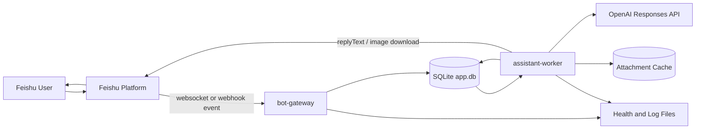
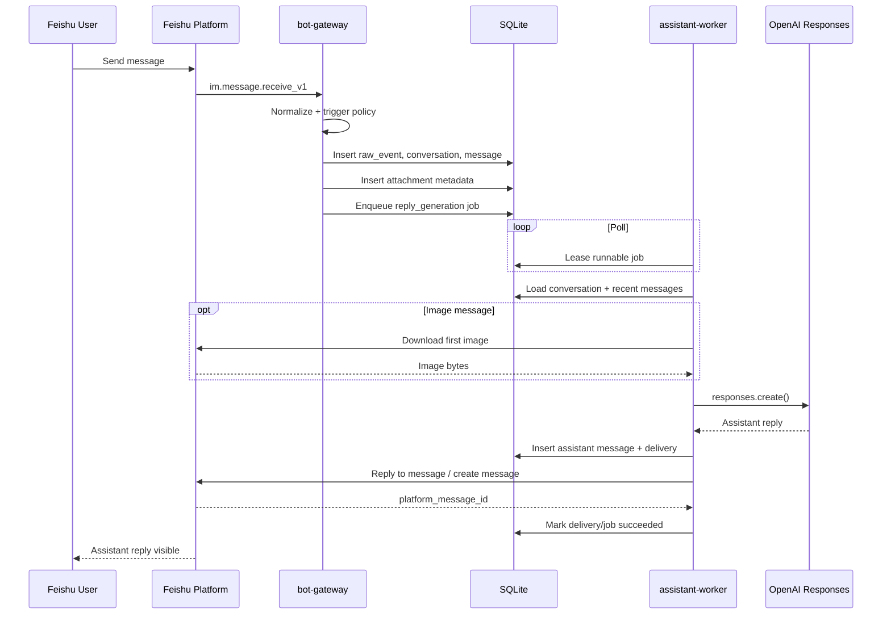
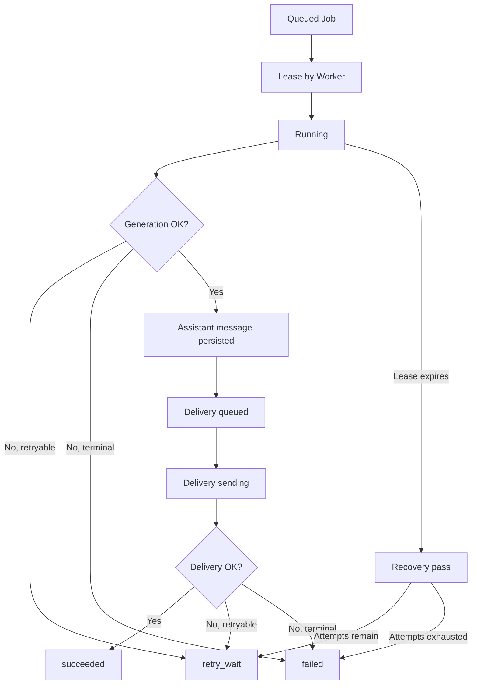

## Executive Summary

| Field | Value |
|-------|-------|
| **Module** | `feishu-server` (`D:\Develop\workspace\feishu-server`) |
| **Purpose** | A local Feishu coding assistant that receives Feishu messages, persists them durably, calls an LLM path, and replies back to Feishu through a queued worker model. |
| **System Role** | Middleware between Feishu IM and an AI execution layer, with SQLite as the durability and coordination boundary between ingress and reply generation. |
| **Criticality** | **High**. If either the gateway, worker, or shared database layer is unavailable, inbound messages are not processed end-to-end. |
| **Technology** | TypeScript, Node.js 24, `node:sqlite`, `@larksuiteoapi/node-sdk`, `openai`, local filesystem runtime directories |

## Technical Analysis

### Responsibilities

- Accept Feishu inbound events through websocket or webhook mode.
- Normalize Feishu messages into a stable internal message model.
- Deduplicate raw events and inbound user messages before work is queued.
- Persist conversations, messages, jobs, deliveries, and image-attachment metadata in SQLite.
- Run reply generation asynchronously through a polling worker.
- Build compact conversation context, optionally using `previous_response_id`.
- Download and attach the first image in an image-bearing Feishu message.
- Deliver assistant replies back to Feishu with delivery retry isolation.
- Publish health snapshots and enforce single-instance startup per role.

### Key Functions and Classes

| Name | Type | Purpose |
|------|------|---------|
| `loadAppConfig` | Function | Loads layered runtime configuration from env, default JSON, and runtime-local JSON. |
| `BotGatewayService` | Class | Main ingress service. Applies trigger policy, dedupes events, persists inbound state, and enqueues jobs. |
| `FeishuLongConnection` | Class | Abstracts Feishu event intake for websocket and webhook runtime modes. |
| `normalizeFeishuMessageEvent` | Function | Converts Feishu payloads into `NormalizedInboundMessage` records and extracts image metadata. |
| `AssistantWorkerService` | Class | Main asynchronous execution service. Leases jobs, builds context, calls the model path, and manages deliveries/retries. |
| `OpenAiResponsesClient` | Class | Wraps OpenAI Responses API calls, including `previous_response_id` continuation fallback. |
| `buildConversationContext` | Function | Builds the worker's compact context window, summary injection, and local follow-up policy. |
| `JobRepository` | Class | Implements the worker-side job state machine: enqueue, lease, renew, retry, recover, succeed, and fail. |
| `DeliveryRepository` | Class | Separates message generation from outbound Feishu delivery state. |
| `MessageAttachmentRepository` | Class | Persists image attachment metadata and download status. |

### Primary Execution Flow

#### 1. Startup and runtime boot

1. `gateway/main.ts` or `worker/main.ts` loads config, creates runtime directories, acquires a lock file, opens SQLite, and runs migrations.
2. The process creates a service object with all concrete adapters injected.
3. The service writes a startup health snapshot and begins its event loop.

#### 2. Inbound message flow: Feishu to queued job

1. `FeishuLongConnection` starts either:
   - websocket mode via the Feishu SDK long-connection client, or
   - webhook mode via a local HTTP server and Feishu callback adapter.
2. Incoming Feishu payloads are passed to `BotGatewayService.processIncomingPayload()`.
3. `normalizeFeishuMessageEvent()` filters unsupported payloads, bot-originated messages, and unsupported chat types.
4. The gateway applies trigger policy:
   - p2p messages are accepted directly,
   - group messages require group mode enabled and a bot mention.
5. Inside one SQLite transaction, the gateway:
   - inserts the raw event if it is new,
   - gets or creates the conversation,
   - inserts the user message if it is new,
   - stores image-attachment metadata,
   - enqueues one `reply_generation` job.
6. Health counters are updated and the gateway returns to waiting for the next event.

#### 3. Worker flow: queued job to assistant reply

1. `AssistantWorkerService` polls SQLite for runnable jobs.
2. Before leasing, it requeues or fails expired running jobs whose lease timed out.
3. The worker leases the next queued or retry-waiting job and starts periodic lease renewal.
4. It loads the conversation, trigger message, recent history, and any stored image attachment metadata.
5. It builds a compact conversation context:
   - selects recent relevant messages,
   - applies local prompt classification,
   - optionally generates a local follow-up or local meta reply,
   - uses stored summary text and `previous_response_id` when applicable.
6. If the trigger message contains an image, the worker downloads the first image from Feishu, caches it locally, and converts it to a data URL.
7. The worker either:
   - emits a local fallback reply, or
   - calls `OpenAiResponsesClient.generateReply()`.
8. The assistant reply is persisted as a new assistant message, and a delivery record is created.
9. The worker sends the reply through `FeishuMessageClient.replyText()`.
10. On success, it marks the delivery and job as succeeded, updates conversation pointers, and refreshes summary text when thresholds are met.

#### 4. Retry and recovery flow

1. Generation failures and delivery failures are classified separately.
2. Retryable failures schedule the job into `retry_wait` with exponential backoff plus jitter.
3. Delivery retries reuse the persisted assistant message instead of regenerating content.
4. Lease expiry recovery prevents jobs from being stranded in `running`.

### State and Data Management

#### Persistence model

| Table | Purpose | Written by |
|------|---------|------------|
| `raw_events` | Event deduplication and audit trail | Gateway |
| `conversations` | Long-lived conversation state and summary metadata | Gateway, Worker |
| `messages` | User and assistant messages | Gateway, Worker |
| `jobs` | Async work queue and job state machine | Gateway, Worker |
| `job_attempts` | Per-attempt execution history | Worker |
| `deliveries` | Reply delivery state decoupled from generation | Worker |
| `message_attachments` | Attachment metadata and download state | Gateway, Worker |
| `_migrations` | Applied schema versions | Startup migration runner |

#### Key state transitions

- `jobs.status`: `queued -> running -> succeeded`
- `jobs.status`: `queued/retry_wait -> running -> retry_wait`
- `jobs.status`: `running -> failed`
- `deliveries.status`: `queued -> sending -> succeeded`
- `deliveries.status`: `queued/sending -> retry_wait -> sending`
- `message_attachments.status`: `pending -> downloaded`
- `message_attachments.status`: `pending -> failed`

The database is the central coordination surface between the two long-lived processes. The gateway does not call the LLM path directly, and the worker does not subscribe to Feishu events directly.

### Error Handling

- SQLite writes run inside explicit `BEGIN IMMEDIATE` transactions for multi-step state changes.
- Failures are classified by stage (`generation` vs `delivery`) and by type:
  - SQLite busy
  - temporary HTTP failure
  - network failure
  - auth failure
  - invalid request
  - permanent failure
  - unexpected failure
- Retry backoff is exponential with jitter and a configurable ceiling.
- Worker lease renewal reduces duplicate work while allowing recovery from crashes.
- Local fallback replies are used for:
  - low-context clarification,
  - meta/capability questions,
  - image messages when image input is unavailable or rejected.

### Internal Dependencies

| Module | Role |
|--------|------|
| `src/apps/bot-gateway` | Feishu ingress process |
| `src/apps/assistant-worker` | Reply-generation and delivery process |
| `src/core/config` | Layered runtime configuration |
| `src/core/db` | SQLite open/transaction/migration logic |
| `src/core/errors` | Retry classification and delay logic |
| `src/core/health` | JSON health-file output |
| `src/core/runtime` | Single-instance lock management |
| `src/domains/feishu` | Feishu ingress and outbound adapters |
| `src/domains/openai` | Prompting, context, and model adapter |
| `src/domains/jobs` | Queue and attempt state |
| `src/domains/messages` | Conversation message persistence |
| `src/domains/attachments` | Image metadata and local cache helpers |

### External Dependencies

| Dependency | Purpose |
|------------|---------|
| `@larksuiteoapi/node-sdk` | Feishu long connection, webhook adapter, reply API, image download |
| `openai` | OpenAI Responses API client |
| `node:sqlite` | Embedded SQLite persistence |
| Local filesystem | Runtime directories for logs, locks, health files, backups, and attachment cache |

## Module Communication

### Consumes

| Source | Type | Description |
|--------|------|-------------|
| Feishu event stream | Async | Inbound `im.message.receive_v1` events via websocket or webhook |
| Feishu IM API | Sync/HTTP | Reply sending and image download |
| OpenAI Responses API | Sync/HTTP | Assistant response generation |
| Runtime config files and env | Sync/file/env | Layered app configuration |
| Shared SQLite database | Sync/local | Cross-process state and queue coordination |

### Exposes

| Target | Type | Description |
|--------|------|-------------|
| Feishu webhook callback | Sync/HTTP | Optional local webhook endpoint |
| SQLite tables | Shared state | Durable event, message, queue, delivery, and attachment records |
| Health JSON files | File output | Runtime heartbeat and queue counters |
| Log files | File output | Structured operational logs |
| Maintenance scripts | CLI/ops | Backup, cleanup, and scheduled-task installation |

### Communication Type

- **Synchronous**
  - Feishu webhook request handling
  - Feishu reply API call
  - OpenAI Responses API call
  - SQLite row operations inside a process
- **Asynchronous**
  - Feishu websocket event stream
  - Gateway-to-worker coordination via queued DB rows
  - Retry scheduling via `available_at`

### Shared State

- SQLite database under the runtime root
- Local image cache directory
- Lock files under `run/`
- Health files under `run/`
- Logs and backups under runtime directories

## Technical Diagrams

### System Context

The following diagram shows the two-process local architecture and the shared state boundary.

### Message-to-Reply Sequence

This sequence diagram shows the main happy path from inbound message to assistant reply.

### Job and Delivery State Flow

## Codex CLI Feasibility Assessment

### Fit Assessment

Integrating the current Codex CLI into this project is **feasible, but not as a drop-in replacement for `OpenAiResponsesClient`**.

The existing worker contract assumes a relatively compact request/response interaction:

- build context,
- call one model endpoint,
- get one text answer,
- persist metadata,
- send one Feishu reply.

Codex CLI is different in three important ways:

1. It is **agentic and process-oriented**, not only text-generation-oriented.
2. It is **workspace-bound**, while the current project has no repository-selection concept in its Feishu message model.
3. It uses **CLI session continuity** (`codex exec resume`) rather than OpenAI's `previous_response_id`.

That means the correct integration seam is the worker's execution boundary, not the gateway and not the message schema as it exists today.

### Key Mismatches With the Current OpenAI Path

- The current project has no persisted `codex_session_id` or workspace mapping per conversation.
- `OpenAiResponsesClient` returns concise text plus token metadata; Codex CLI returns CLI events, session state, and may run tools or write files.
- The current worker assumes the assistant reply is ready when the API call returns; Codex workflows may be slower and more stateful.
- The current trigger model is chat-centric; Codex CLI needs an explicit repository root and sandbox/approval policy.
- The current safety model is suitable for an IM assistant; Codex CLI can execute commands, so misuse has a much higher blast radius.

### Integration Options

| Option | What Changes | Feasibility | Recommendation |
|--------|--------------|-------------|----------------|
| Keep OpenAI as default; no Codex integration | No architectural change | **High** | Good baseline, but does not add Codex capabilities |
| Replace `OpenAiResponsesClient` with `codex exec` for all worker jobs | Add workspace mapping, session persistence, CLI subprocess runner, output parsing, and safety policy | **Medium** | Technically possible, but too disruptive for the current IM-first product |
| Add an opt-in Codex execution mode in the worker, while preserving OpenAI as default | Add backend routing, conversation-to-workspace mapping, `codex_session_id`, subprocess adapter, and explicit command policy | **High** | **Recommended** |
| Expose this service to Codex as a tool instead of calling Codex from the service | Build MCP surface around Feishu-side workflows | **Medium** | Useful for operators, but not the same as Feishu bot using Codex |

### Recommended Integration Path

#### Phase 1: Safe opt-in backend switch

- Keep the existing OpenAI path as the default.
- Add a worker-side execution mode such as:
  - `OPENAI` for current behavior
  - `CODEX` for selected conversations or explicit commands
- Restrict Codex mode to:
  - direct chats only,
  - one fixed repository root per conversation,
  - read-only or tightly constrained workspace policy at first.

#### Phase 2: Session-aware Codex adapter

Add a new adapter, for example `CodexCliClient`, that:

- runs `codex exec --cd <repo> --json -o <file> "<prompt>"` for the first turn,
- stores the returned Codex session id,
- resumes the same session via `codex exec resume <session-id> "<prompt>"` on follow-up turns,
- extracts only the final assistant-facing message for Feishu delivery,
- stores raw CLI traces separately for debugging.

#### Phase 3: Schema changes required

At minimum, add:

- `conversations.codex_session_id`
- `conversations.workspace_root`
- optionally `messages.execution_backend`
- optionally a `tool_runs` or `cli_runs` table for subprocess logs and exit codes

#### Phase 4: Safety and operational controls

- Explicit allowlist of workspace roots
- Strong separation between read-only analysis mode and write-capable mode
- Per-job timeout and output truncation
- Concurrency guard so one Feishu conversation does not launch overlapping Codex sessions against the same workspace
- Group-chat disablement for Codex mode until authz and workspace-scoping are mature

### Why Full Replacement Is Not Ideal Right Now

Replacing OpenAI directly with Codex CLI would force this project to become a local coding agent orchestrator rather than a chat assistant. That would introduce new product and infrastructure concerns:

- repo discovery and selection UX,
- tool side effects,
- file-edit approvals,
- dirty working tree management,
- long-running jobs and partial progress,
- stronger audit and rollback expectations.

Those concerns are real, but they are outside the current system's original architecture.

### Practical Conclusion

**Feasible:** yes.  
**Low-risk as a full swap:** no.  
**Best approach:** add Codex CLI as an explicit worker execution mode behind a new adapter and conversation-to-workspace mapping, while keeping the current OpenAI path as the default conversational backend.

## Metrics

| Metric | Current | Target | Delta | Status |
|--------|---------|--------|-------|--------|
| Long-lived runtime processes | 2 | 2 | 0 | DONE |
| Core persisted operational tables | 7 | 7 | 0 | DONE |
| Supported Feishu ingress modes | 2 | 2 | 0 | DONE |
| Current worker execution backends | 1 (`OpenAI`) | 2 (`OpenAI` + `Codex`) | +1 | AT_RISK |
| Extra conversation fields needed for Codex continuity | 0 | 2+ | +2+ | NOT_STARTED |

## Referencias

- [README.md](./README.md)
- [docs/runbook.md](./docs/runbook.md)
- [docs/operations.md](./docs/operations.md)
- [src/apps/bot-gateway/main.ts](./src/apps/bot-gateway/main.ts)
- [src/apps/bot-gateway/service.ts](./src/apps/bot-gateway/service.ts)
- [src/apps/assistant-worker/main.ts](./src/apps/assistant-worker/main.ts)
- [src/apps/assistant-worker/service.ts](./src/apps/assistant-worker/service.ts)
- [src/core/config/index.ts](./src/core/config/index.ts)
- [src/core/db/database.ts](./src/core/db/database.ts)
- [src/core/db/migrations.ts](./src/core/db/migrations.ts)
